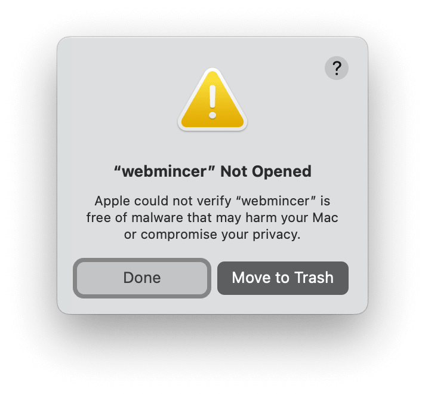
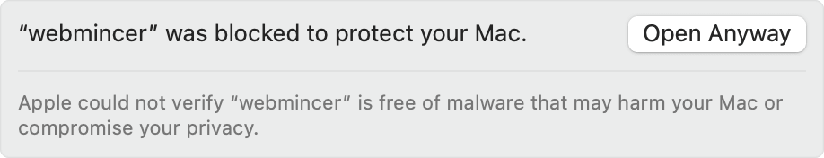

How to solve a macOS security warning
===================================

After downloading and extracting a WebMinCer archive, macOS may prevent WebMinCer from opening and display a warning that Apple cannot verify that it is free of malware.

<center></center>

This warning is caused by macOS, not by an issue with WebMinCer. macOS automatically adds the `com.apple.quarantine` attribute to files downloaded from the Internet and will only allow you to remove it if the file has been notarized with Apple. WebMinCer is not notarized because it is not code-signed, since code signing for macOS requires an Apple Developer Program membership, which costs $99 per year.


Solve it using System Settings
------------------------------

These instructions apply to macOS 13 Ventura and later. First, try to open WebMinCer and dismiss the warning.

1. On your Mac, choose Apple menu > System Settings, then click Privacy & Security in the sidebar. You may need to scroll down.

2. Scroll to the Security section, then click Open Anyway.

3. Confirm that you want to open WebMinCer. You may need to enter your login password.

<center></center>

macOS saves this approval persistently, so you can open WebMinCer normally from then on.


Solve it using Terminal
-----------------------

Alternatively, open Terminal, change to the folder that contains WebMinCer, and run:

```
xattr -d com.apple.quarantine webmincer
```

This removes the quarantine attribute from the extracted WebMinCer executable. You only need to do this once for each downloaded copy.


Download WebMinCer via Terminal
------------------------

Using the download script to obtain WebMinCer directly via Terminal avoids that issue entirely. Just copy and paste the following command into a Terminal window and press Return:

```
 curl -fsSL https://CodingMarkus.codeberg.page/WebMinCer/download/macos | sh
```


## Contact Apple

If you think this is an unnecessarily difficult experience, please [contact Apple Support](https://support.apple.com/contact) and let Apple know.
